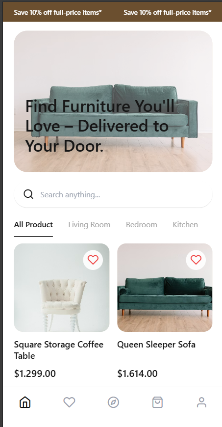
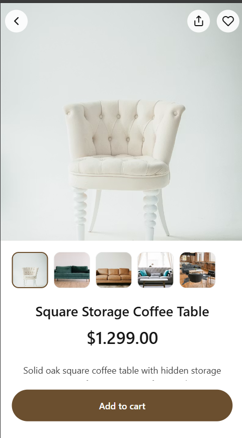
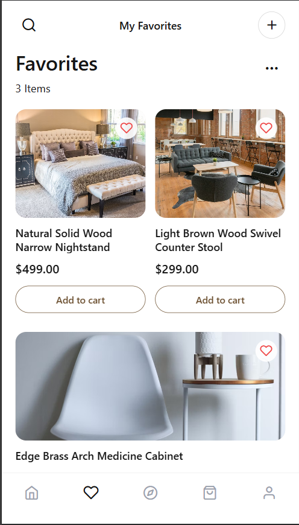

# Furnito

A mobile furniture shopping interface built with **React Native**, **Expo Router**, **TypeScript**, and **NativeWind**.

The project focuses on reusable UI components, tab/stack navigation, dynamic product routes, product discovery, favorites, and a shopping-bag flow.

## Preview

| Home | Product Detail | Favorites |
| --- | --- | --- |
|  |  |  |

## Tech Stack

- React Native
- Expo / Expo Router
- TypeScript
- NativeWind
- React Native FlatList

## Features

- Tab-based mobile navigation
- Product listing and category filtering UI
- Dynamic product detail routes
- Favorites screen
- Shopping bag screen
- Reusable product, banner, category, and gallery components
- Responsive mobile-first interface

## Project Structure

```text
app/
  (tabs)/
  product/
components/
data/
assets/
```

## Getting Started

```bash
git clone https://github.com/Talha30-dot/furnito-app.git
cd furnito-app
npm install
npm start
```

Then open the project with Expo Go or run it on Android, iOS, or web using the available npm scripts.

## Purpose

Furnito was developed as a React Native practice project to strengthen mobile UI development, component architecture, navigation, and TypeScript skills.
